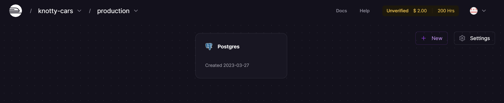
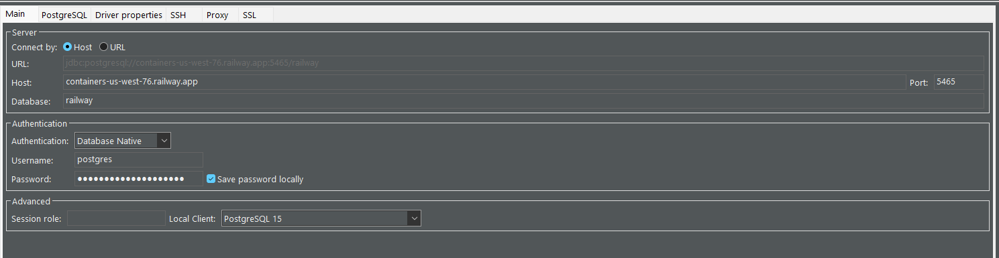
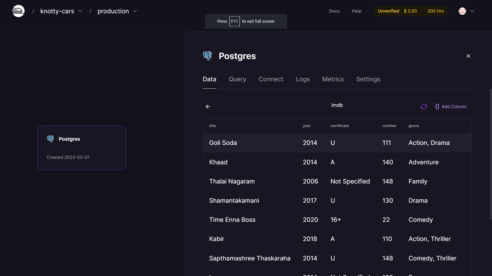
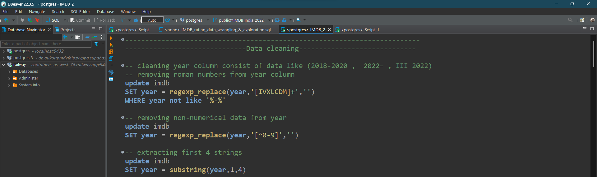
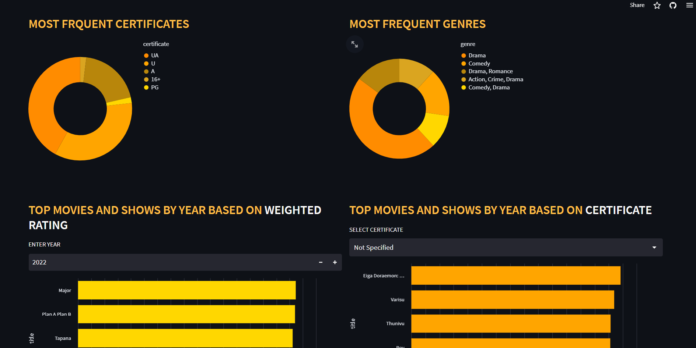
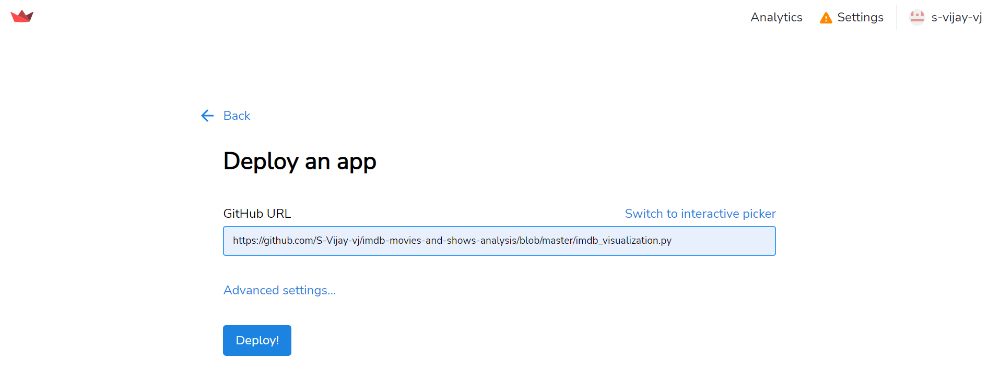

# Movie Mosaic: A Visual Journey through IMDB Ratings

This project is a data analysis and visualization of IMDB ratings of over 10,000 movies and shows. An SQL database is deployed in the cloud and connected to a SQL editor .The data wrangling part is done using SQL, and then SQL database is connected to Python and visualized using libraries such as pandas, altair, and streamlit. The project also includes a dashboard that is deployed using streamlit.
[Open Webpage !!](https://s-vijay-vj-imdb-movies-and-shows-anal-imdb-visualization-4gxxsx.streamlit.app/)

## Project Flow
  - [Database Deployment](#Database-Deployment)
  - [Data Wrangling](#Data-Wrangling)
  - [Data Visualization](#Data-Visualization)
  - [Dashboard Creation](#Dashboard-Creation)
  - [Webpage Deployment](#Webpage-Deployment)

## Database Deployment
A PostgreSQL database is deployed in `Railway.app` which is inspired by Heroku and is built with the aim of making app development tools easier to access for developers.

This SQL database is then connected to DBeaver, a free and open source universal database tool. And a table is created by importing data from CSV file.

## Data Wrangling
The cleaning and wrangling of the IMDB ratings data is done by writing SQL queries in DBeaver. This involved dealing with missing values, data type conversion, and data aggregation, etc...
 [Open SQL query file](data_wrangling_using_SQL.sql)

## Data Visualization
After cleaning the data, the next step was to perform analysis using Python. For this, the SQL database is conneected to python. Pandas, Altair, and Streamlit were used to create interactive visualizations, such as bar charts, and heatmaps to gain insights into the data.
 [Open python file](imdb_visualization.py)

## Dashboard Creation
A Streamlit dashboard was created to present the visualizations in an interactive and user-friendly manner. This dashboard allows the user to filter the data and visualize the results dynamically.

## Webpage Deployment
The final step was to deploy the dashboard using Streamlit. The deployment process made it possible for users to access the dashboard online and interact with the visualizations.

